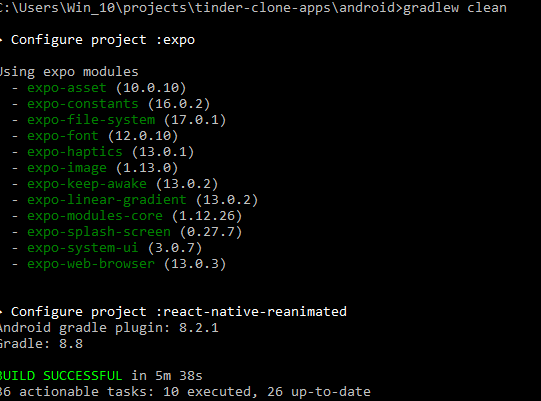

# Tinder Clone App (React Native)

This is a **React Native** project for a Tinder-like app, built with **Expo**.  
It implements swipe cards, likes/dislikes, and connects to the **Tinder Clone Server** API.

---

## Table of Contents

- [Getting Started](#getting-started)
- [Running the App](#running-the-app)
- [Testing API](#testing-api)
- [Notes](#notes)
- [Disclaimer](#disclaimer)

---

## Getting Started

1. Clone the repository:

```bash
git clone https://github.com/guntar/tinder-clone-apps.git
cd tinder-clone-apps
```

2. Install dependencies:

```bash
npm install
# or
yarn install
```

### Running the App

> We using Expo Bare Workflow.

> Android emulator: via Android Studio or Android Device using USB cable

> In a new terminal, still in the project root:

```bash
cd android
gradlew clean
cd ..
npx expo prebuild --clean -p android
npx expo run:android
```

Development build: for faster performance and native features 

## Testing API

Ensure the Tinder Clone Server is running locally (http://127.0.0.1:8090) to do testing endpoint swagger go to (http://127.0.0.1:8090/api/v1/documentation) or accessible remotely.

> Use Swagger UI or Postman to test the server endpoints before running the app.

### Notes
```bash
java --version
openjdk version "17.0.16" 2025-07-15
OpenJDK Runtime Environment Temurin-17.0.16+8 (build 17.0.16+8)
OpenJDK 64-Bit Server VM Temurin-17.0.16+8 (build 17.0.16+8, mixed mode, sharing)
```
> Set Gradle Properties in `/android` directory
```bash
cd android
gradlew clean
set NODE_ENV=development
```

> wait for downloading until completed.
```bash
cd ..
npx expo prebuild --clean -p android
npx expo run:android
```
> Make sure your android device by using smartphone or AVD device it's authorize . see list of device :
```bash
adb devices
```
> For this project we use `sdk version 34`

## Join the community

Join our community of developers creating universal apps.

- [Expo on GitHub](https://github.com/expo/expo): View our open source platform and contribute.
- [Discord community](https://chat.expo.dev): Chat with Expo users and ask questions.
